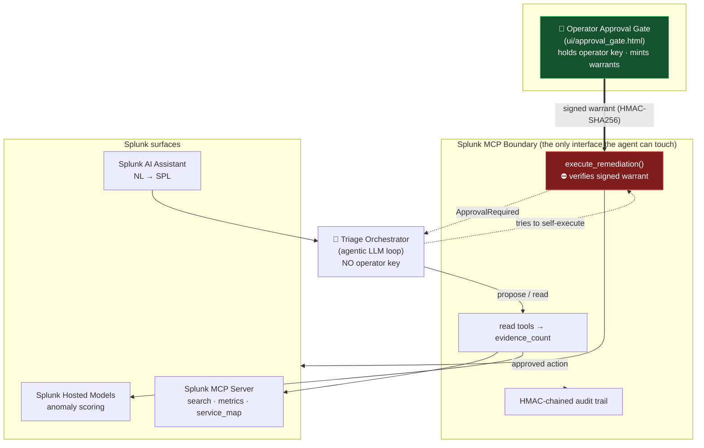

# SentryOps Copilot — Architecture

The agent's **only** path to the world is the Splunk MCP boundary. The operator
approval surface and the MCP boundary share a signing key; the agent does not
hold it. Every read returns an evidence count; the one write tool requires a
signed warrant.

## The trust boundary in one sentence

> The human approval gate is a **cryptographic check the boundary performs**, not
> a button the agent renders — so no prompt injection can make the agent approve
> its own action.

## Flow

1. **Alert in** → orchestrator asks the **AI Assistant** to turn the alert into SPL.
2. **MCP Server** `search` / `metrics` / `service_map` return structured evidence
   (each carries `evidence_count`).
3. **Hosted Model** scores the events; the agent reasons over the returned
   confidence (it does not invent the score).
4. Orchestrator emits a **finding only if `evidence_count > 0`** and *proposes* a
   remediation.
5. Agent's attempt to execute autonomously is **denied** at the boundary.
6. A human **operator** reviews and mints a **warrant** (HMAC-SHA256 bound to the
   exact action).
7. `execute_remediation(action, warrant)` verifies and runs; the full sequence is
   written to the **tamper-evident audit chain** and exported back to Splunk.

## Note on scope

This repository is a self-contained demo project built for evaluation. The Splunk
surfaces are exercised through documented integration points in
`src/sentryops/splunk_mcp.py`; the bundled demo backs them with synthetic
fixtures so the architecture can be verified without a live tenant.
